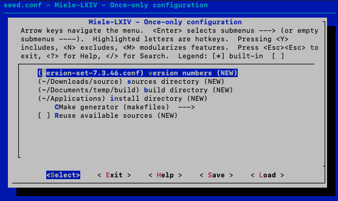
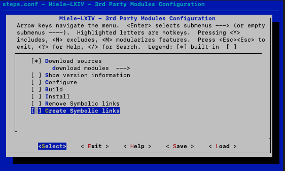
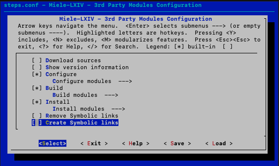
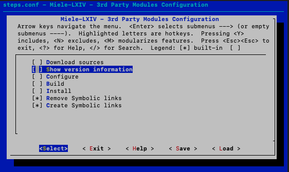
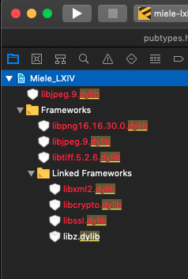
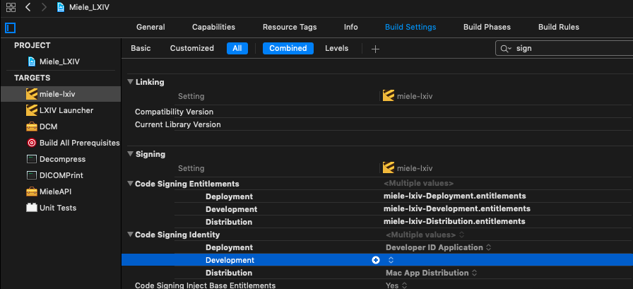

# Miele-LXIV Build System

Copyright  Alex Bettarini, 2019

---

The purpose of this project is to assist in setting up and configuring all dependencies for the project [Miele-LXIV](https://github.com/bettar/miele-lxiv) and to ensure that it builds smoothly.

The directory where this file has been downloaded will be referred to as `EASY_HOME`

Additionally, you must define the three top-level directories involved in the process:

1. *sources*: `SRC` where all the source files will be downloaded
2. *build*: `BLD`
3. *install*: `BIN`

---
### Prerequisite tools:

- kconfig-mconf

	This is a tool normally used in Linux systems to rebuild the kernel with a custom configuration. It's probably possible to install it from [sources](http://distortos.org/documentation/building-kconfig-frontends-linux/), and the dependencies can be installed using brew (gperf ncurses flex bison). 
	 Instead, I found it very convenient to install it like in the [NuttX](https://bitbucket.org/nuttx/) project:
	
		$ mkdir -p $SRC/nuttx
		$ cd $SRC/nuttx
		$ git clone https://bitbucket.org/nuttx/tools.git
		
		$ cd $SRC/nuttx/tools/kconfig-frontends
		$ ./configure --disable-shared --enable-static --disable-gconf --disable-qconf --disable-nconf --disable-utils
		$ make
		$ sudo make install

- wget
- CMake (make sure the command line tools are installed)

		
---
### STEP 1: Once-only configuration

- Assuming the file `$EASY_HOME/seed.conf` hasn't been created yet, do the following:

		$ cd $EASY_HOME
		$ ./build.sh
	
	If you are brave or have the need for it, define and select your own version set file. I suggest you don't change anything, to get a default, tried and tested setup.

	- Save, ok, exit
	- Exit

	

---
### STEP 2: Download sources

- This is also a step that should be run once only:

		$ ./reconfigure.sh

	- enable "Download sources" and possibly disable all other steps
	- Save, ok, exit
	- Exit

	

	Run the bash  script that carries out the downloads:

		$ ./build.sh

---
### STEP 3: Build and install the toolkits

- If everything goes smoothly this step is also done once only:

		$ ./reconfigure.sh

	- If "Download sources" is enabled, disable it: you don't want to download everything again.
	- Enable Configure, Build, Install
	- Save, ok, exit
	- Exit

	

	Run the bash script. This might take a long time. To capture possible errors and warning, save the output to a log file:

		$ script log-$(date +%Y%m%d_%H%M).txt
		$ ./build.sh
		$ exit

---
### STEP 4: Make installed toolkits available to Xcode project

- This step sets up the `Binaries` directory of the Xcode project

		$ ./reconfigure.sh

	- Enable only "Create Symbolic links"
	- Save, ok, exit
	- Exit

	

	Run the bash script.

		$ ./build.sh

---
### STEP 5: Xcode

- Launch the Xcode project `Miele_LXIV.xcodeproj` located in `SRC`

	-  If required, fixup *libjpeg*, *libpng*, *libtiff*. 
	For older Miele-LXIV versions (7.1.34) you might get some missing files, shown in red in the Xcode project navigator. Using Finder, drag and drop the 3 libraries with the same name from the `BIN` directory where you just built them, to the Xcode project navigator panel, next to the items that show up in red:

	

	- menu: "Product", "Scheme", "Edit Scheme...", "Run", "Info", "Build Configuration", select "Development", "Close"
	- "PROJECT", "Info", Localization, remove all languages except "English - Development Language"
	- menu: "Product", "Build"

- If when you run the application you get some error with signing certificate, try removing the Signing Identity for the Development configuration:

	

- When everything is working, you can start making modifications to the code and re-build the project from Terminal

		$ xcodebuild -configuration Development -target miele-lxiv