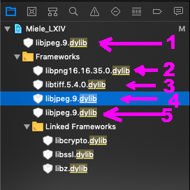
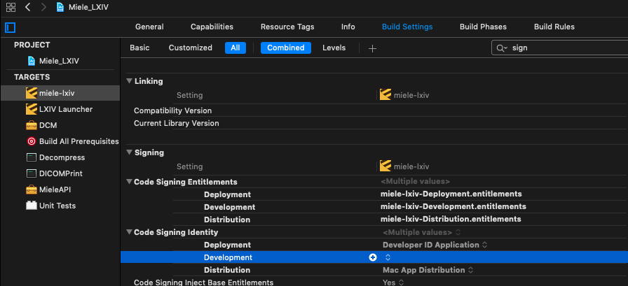

# version-set-7.3.46
## Step 5

Launch the Xcode project `Miele_LXIV.xcodeproj` located in `SRC`

- Select the scheme `miele-lxiv`

	

- Xcode menu: "Product", "Scheme", "Edit Scheme...", "Run", "Info", "Build Configuration", select "Development", "Close"
- Xcode "PROJECT", "Info", Localization, remove all languages except "English - Development Language". When prompted, unselect the option "Delete localized resources files from disk".

---
With reference to the following image:

- remove 1,2,3,4,5 (only the reference to the library files)

- add back those library files by Drag and Drop from the indicated subdirectories where the Miele_LXIV.xcodeproj has been downloaded:

	- target membership both *miele-lxi*v and *Decompress*
		- `Binaries/libpng/lib/libpng16.16.35.0.dylib` 
		- `Binaries/libtiff/lib/libtiff.5.4.0.dylib`

	- target membership only *miele-lxiv*
		- `Binaries/libjpeg/lib/libjpeg.9.dylib`

You end up with this:

---

With reference to the following image, change the file extension of two libraries from `.dylib` to `.a` for TARGET *Decompress* (Development)

---
- Xcode menu: "Product", "Build"
- If when you build the application you get some error with signing certificate, remove the Signing Identity for the Development configuration:

	
