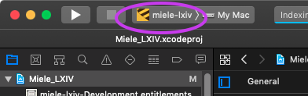
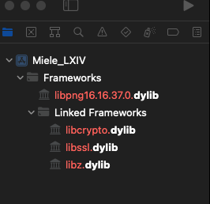
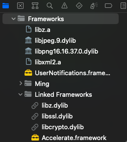
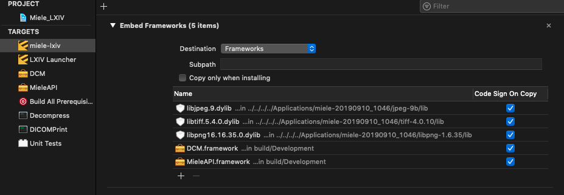

# version-set-8.8
## Step 5

Launch the Xcode project `Miele_LXIV.xcodeproj` located in `SRC`

- Select the scheme `miele-lxiv`

	

- Xcode menu: "Product", "Scheme", "Edit Scheme...", "Run", "Info", "Build Configuration", select "Development", "Close"

---
With reference to the following image:

- remove the 4 files listed in red color (only the reference to the library files)

- add back those library files by Drag and Drop from the indicated subdirectories where the Miele_LXIV.xcodeproj has been downloaded:

	- target membership both *miele-lxiv* and *Decompress*
		- `Binaries/libpng/lib/libpng16.16.37.0.dylib` 
		- `Binaries/libtiff/lib/libtiff.5.4.0.dylib`

	- target membership only *miele-lxiv*
		- `Binaries/libjpeg/lib/libjpeg.9.dylib`

		- openssl-1.1.1d/lib/libcrypto.dylib

	- target membership *miele-lxiv* *MieleAPI* *Decompress* *DICOMPrint*
		- `Binaries/libxml2/lib/libxml2.a` 

	- target membership *miele-lxiv* *MieleAPI* *Decompress*
		- `Binaries/zlib/lib/libz.a` 

	- target membership *DICOMPrint*
		- `Binaries/zlib/lib/libz.dylib` 
	
You end up with this:

(TBC) Make sure they get included in the bundle

---
- (TBC) make sure `miele-lxiv-lite.zip` exists in `Binaries/`
- In the GLEW steps, if you get an error

		bash: python: command not found

	you can try doing
	
		$ ln -s /usr/local/bin/python3 /usr/local/bin/python
		
- Xcode project: change `MACOSX_DEPLOYMENT_TARGET` from 10.9 to 10.13 (8 places)

---
#### Fix issue "Cannot initialize a parameter of type 'NSObject *' with an lvalue of type 'Class'"

Edit the following files:

- WebPortal.h

	- change line 61

			+(void)initializeWebPortalClass;

		to

			+(void)initializeWebPortalClass:(id)observer;

- WebPortal.mm

	- line133, change

			+(void)initialize

		to

			+(void)initialize:(id)observer

	- line 138, change

			addObserver:self

		to

			addObserver:observer

	- line 142, change

			+(void)initializeWebPortalClass

		to

			+(void)initializeWebPortalClass:(id)observer

	- line 143-157, change
	
			addObserver:self
	
		to
		
			addObserver:observer

- AppController.h

	- change line 61
	
			+(void)initializeDicomDatabaseClass;
	
		to
		
			+(void)initializeDicomDatabaseClass:(id)observer;

- AppController.mm

	- line 3529, change

			[DicomDatabase initializeDicomDatabaseClass];

		to

			[DicomDatabase initializeDicomDatabaseClass:self];

	- line 3532, change

			[WebPortal initializeWebPortalClass];

		to

			[WebPortal initializeWebPortalClass:self];

- DicomDatabase.h
	
	- line 61, change
	
			+(void)initializeDicomDatabaseClass;
	
		to
		
			+(void)initializeDicomDatabaseClass:(id)observer;

- DicomDatabase.mm
	
	- line 91, change
	
			+(void)initializeDicomDatabaseClass
	
		to
	
			+(void)initializeDicomDatabaseClass:(id)observer
	
	- line 92, change
	
			addObserver:self
	
		to
	
			addObserver:observer

---

- Xcode project, TARGETS miele-lxiv, Build Settings, "Other linker flags"
	

	- make sure this library is in the list:
	
			/usr/local/lib/libwebp.a

	- add library:
	
			/usr/local/lib/libsharpyuv.a
	
---
- Xcode menu: "Product", "Build"

